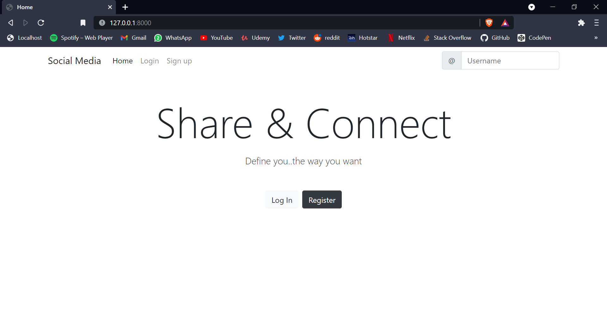
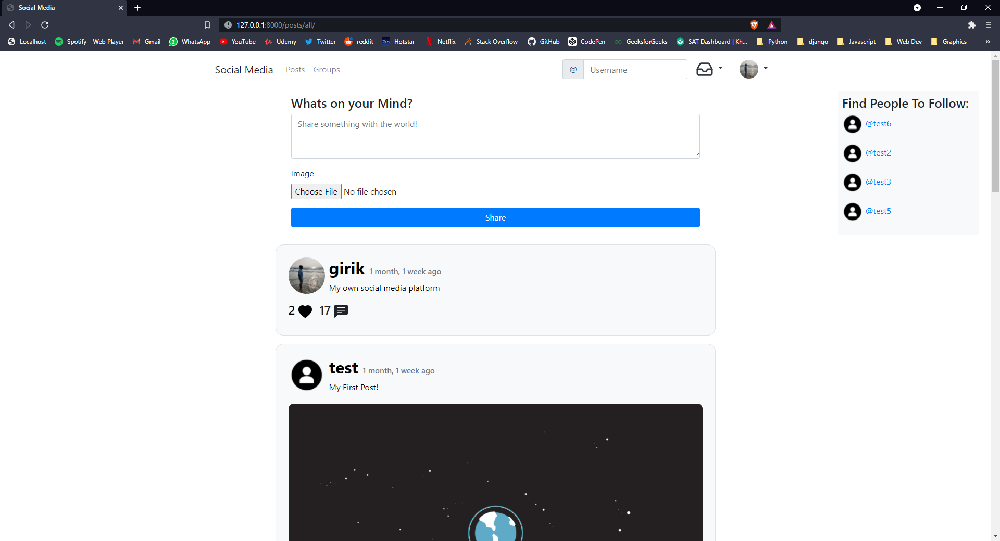
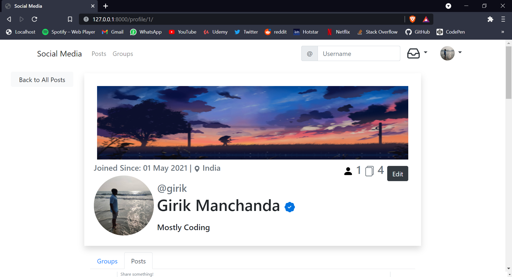
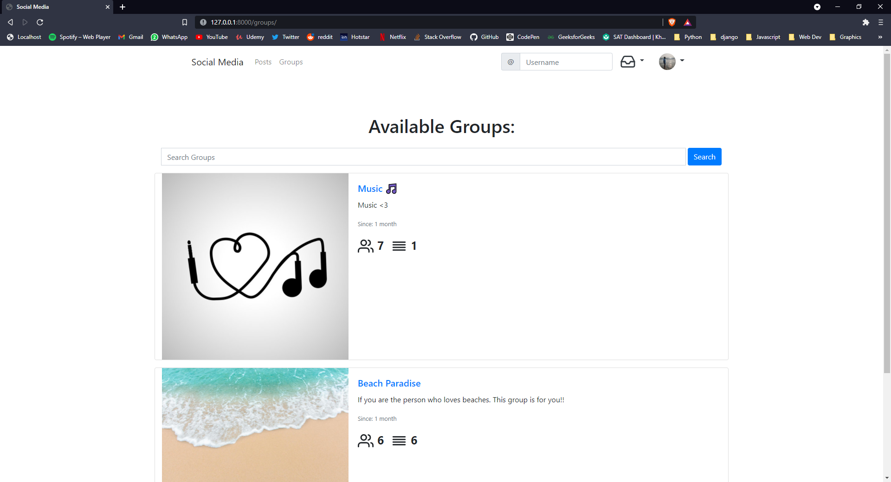
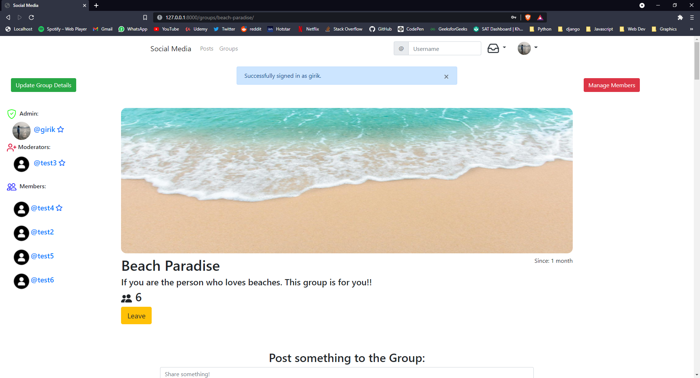
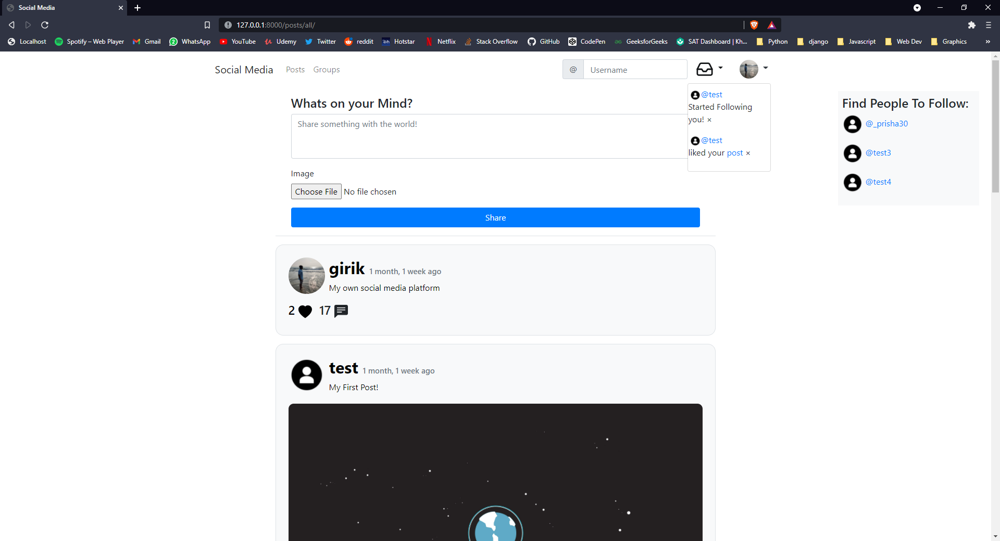

# Social-Media
A social Media platform made using django

# How to run this project:
```
pip install -r requirements.txt
```
```
python manage.py runserver
```
# Features
- Post CRUD
- Groups CRUD, admin and mods, ban, join-leave, group posts
- Notifications
- User Profiles 
- Follow un-follow users
- Personalised feed
- Search user functionality 












